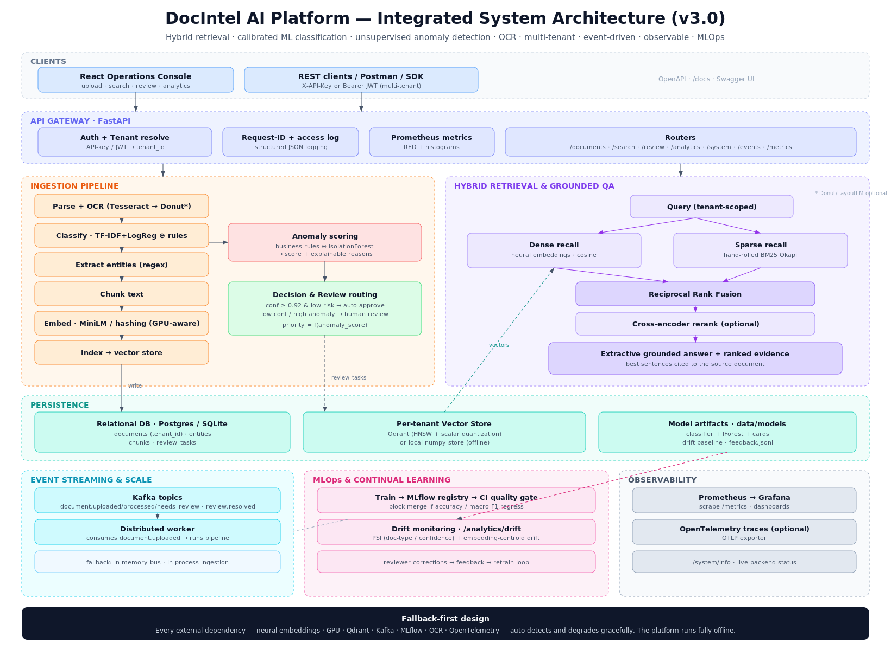
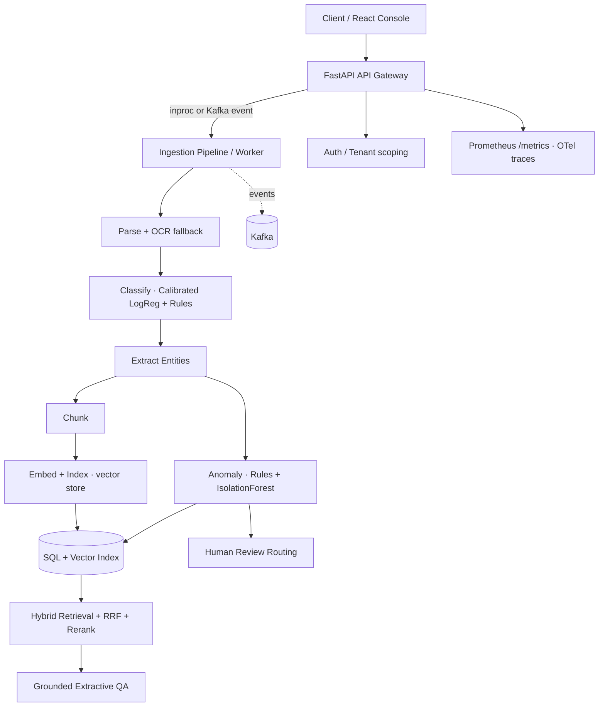
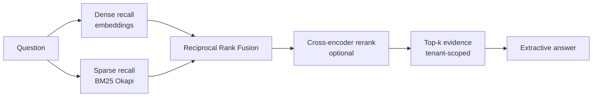
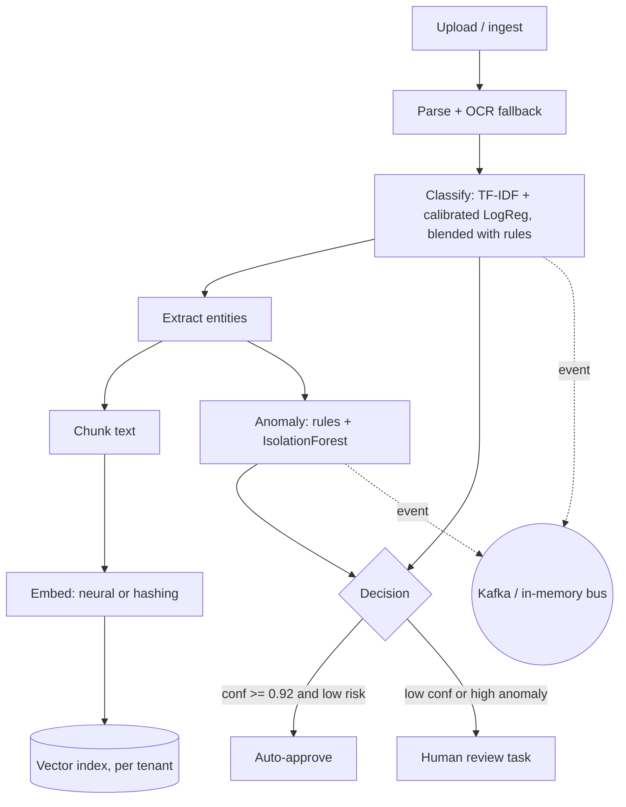
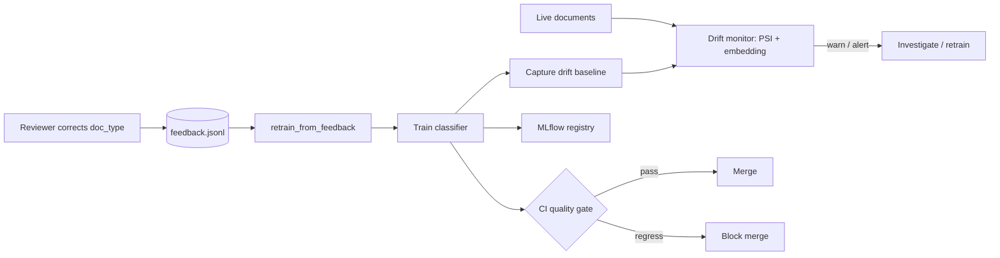
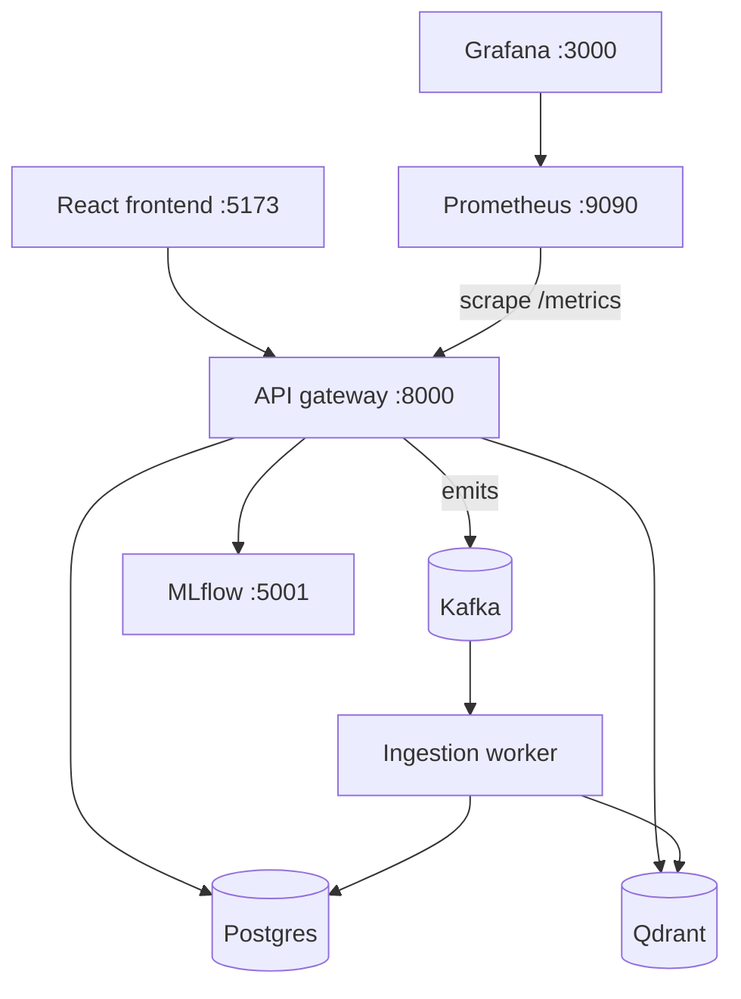
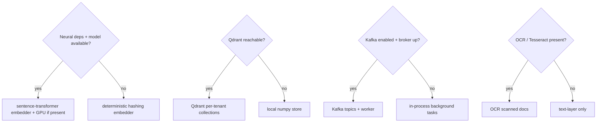

# DocIntel AI Platform

<div align="center">


### Enterprise-grade AI platform for intelligent document processing, retrieval, extraction & review automation

</div>

---

## Overview

**DocIntel AI Platform** ingests documents (including scanned PDFs and images via
OCR), classifies them with a calibrated ML model, extracts structured fields,
indexes semantic chunks into a vector store, answers grounded questions with
hybrid retrieval, scores anomalies with an unsupervised model, and routes
uncertain or risky outputs to human reviewers — with multi-tenant auth, event
streaming, a distributed worker, and a full observability stack.

### What is actually under the hood

The intelligence is real, not keyword matching dressed up as AI:

| Capability | Implementation |
|---|---|
| **Semantic search** | Neural sentence embeddings (`all-MiniLM-L6-v2`) in a **persisted vector index** (Qdrant or local numpy) |
| **Hybrid retrieval** | Dense (bi-encoder) **+** sparse (hand-implemented **BM25 Okapi**) fused with **Reciprocal Rank Fusion** |
| **Reranking** | Optional **cross-encoder** (`ms-marco-MiniLM-L-6-v2`) — the classic *retrieve-then-rerank* pattern |
| **Grounded QA** | **Extractive** answer synthesis grounded in the top document |
| **Classification** | **TF-IDF + calibrated logistic regression** (Platt-scaled probabilities) blended with rules |
| **Anomaly detection** | Deterministic rules **+** unsupervised **IsolationForest** over engineered features |
| **OCR** | **Tesseract** for scanned PDFs / images, auto-triggered when no text layer exists |
| **GPU inference** | Embedder & reranker auto-detect **CUDA** (fp16) and fall back to CPU |
| **Multi-tenancy** | **API-key / JWT** auth with per-tenant data + search isolation |
| **Event streaming** | Domain events to **Kafka** (in-memory fallback) consumed by a distributed worker |
| **Observability** | **Prometheus** metrics, structured JSON logs w/ request ids, optional **OpenTelemetry** tracing |
| **Tracking** | Optional **MLflow** logging + model **registry**, with a **CI quality gate** |
| **Layout OCR** | Optional **Donut/LayoutLM** layout-aware extractor (falls back to Tesseract) |
| **Scale & isolation** | **Per-tenant** Qdrant collections + tunable **HNSW / scalar quantization** |
| **Drift & learning** | PSI + embedding **drift monitoring** and a **reviewer-feedback retraining** loop |

### Graceful degradation (runs anywhere)

Every heavy dependency is optional and **auto-detected**. With no GPU, no model
downloads, no Tesseract, no Kafka and no running services, the platform falls
back to a deterministic hashing embedder, a local numpy vector store, rule-based
classification, rule-only anomaly scoring, in-process ingestion and an in-memory
event bus — so `pytest` (44 tests) and a local demo run fully offline, while
production lights up the neural + distributed path with no code changes.

---

## System architecture



> Rendered from [`docs/architecture_diagram.svg`](docs/architecture_diagram.svg). Interactive Mermaid views below.



## Retrieval pipeline



---

## Ingestion pipeline



## Feedback & drift loop



## Deployment topology



## Graceful degradation (auto-detected at runtime)



---

## Results & walkthrough

Authentic outputs from a clean run (`EMBEDDING_BACKEND=hashing` for reproducibility; the Docker stack uses the neural backend).

**1 — Train models** (`make train` → `data/models/*.joblib` + model cards):

```json
// document_classifier.card.json
{ "algorithm": "tfidf + calibrated logistic regression",
  "classes": ["bank_statement","claim_form","compliance_report","contract","invoice","resume"],
  "n_samples": 960, "n_train": 768, "n_test": 192,
  "test_accuracy": 1.0, "test_macro_f1": 1.0, "cv_accuracy_mean": 1.0 }

// anomaly_iforest.card.json
{ "algorithm": "IsolationForest (unsupervised)", "n_estimators": 200, "contamination": 0.02,
  "feature_names": ["log_text_len","n_entities","n_numeric","log_max_value",
                    "log_sum_value","invoice_total_residual","tax_ratio","log_amount_claimed"],
  "normal_recall": 0.9792 }
```

**2 — Live backend status** (`GET /api/v1/system/info`):

```json
{
  "app": "DocIntel AI Platform", "version": "3.0.0",
  "embedding": { "backend": "sentence_transformer:all-MiniLM-L6-v2@cpu", "dim": 384, "device": "cpu" },
  "vector_store": { "backend": "qdrant", "vectors": 3, "tenants": 1 },
  "retrieval": { "rrf_k": 60, "dense_top_k": 30, "sparse_top_k": 30, "reranker": "cross_encoder:ms-marco-MiniLM-L-6-v2@cpu" },
  "ocr": { "enabled": true, "engine": "tesseract", "available": true },
  "auth": { "enabled": false, "tenants": ["default"] },
  "events": { "backend": "kafka", "ingestion_mode": "kafka" },
  "classifier": { "loaded": true }, "anomaly_model": { "loaded": true }
}
```

**3 — Ingest + classify + score + route** (`POST /api/v1/documents/ingest-sample`):

```json
[
  { "filename": "claim_high_value.txt", "doc_type": "claim_form", "confidence": 0.9627, "anomaly_score": 0.4004, "status": "needs_review" },
  { "filename": "contract_aurora.md",   "doc_type": "contract",   "confidence": 0.9409, "anomaly_score": 0.0768, "status": "approved" },
  { "filename": "invoice_nova.txt",     "doc_type": "invoice",    "confidence": 0.9744, "anomaly_score": 0.1809, "status": "approved" }
]
```

The high-value claim is correctly routed to **human review**; the clean contract and invoice **auto-approve**.

**4 — Grounded hybrid search** (`POST /api/v1/search/query`):

```json
{
  "answer": "... Vendor: Nova Industrial Supplies  Total Amount: 1375.00 [grounded in: invoice_nova.txt]",
  "top_evidence": { "filename": "invoice_nova.txt", "score": 0.0328, "dense_score": 0.1203, "sparse_score": 4.2279 },
  "strategy": { "embedding_backend": "...", "vector_backend": "...", "dense_candidates": 3,
                "sparse_candidates": 2, "fused_candidates": 3, "reranked": true, "latency_ms": 4.3 }
}
```

**5 — Operational analytics** (`GET /api/v1/analytics/overview`):

```json
{ "documents_total": 3, "documents_by_type": {"claim_form":1,"contract":1,"invoice":1},
  "documents_by_status": {"approved":2,"needs_review":1},
  "average_anomaly_score": 0.2194, "documents_auto_approved": 2, "documents_pending_review": 1 }
```

**6 — Drift report** (`GET /api/v1/analytics/drift`) — PSI + embedding-centroid drift vs the training baseline:

```json
{ "status": "alert", "doc_type_psi": 6.3584, "confidence_psi": 0.0,
  "embedding_drift": 0.6773, "n_documents": 3, "baseline_n": 960,
  "thresholds": { "warn": 0.1, "alert": 0.25 } }
```

(3 mixed docs vs a balanced 960-doc baseline → high PSI, correctly flagged `alert`; converges as volume grows.)

**7 — Prometheus metrics** (`GET /api/v1/metrics`, excerpt):

```text
docintel_requests_total{method="POST",path="/api/v1/search/query",status="200"} 1.0
docintel_retrieval_seconds_count 1.0
docintel_documents 3.0
docintel_review_tasks_open 1.0
docintel_index_vectors 3.0
docintel_avg_anomaly_score 0.2194
```

**8 — CI model-quality gate** (`python scripts/check_model_quality.py`):

```text
test_accuracy=1.0 (gate >= 0.85)
test_macro_f1=1.0 (gate >= 0.85)
MODEL QUALITY GATE: PASSED
```

**9 — Test suite** (`make test`):

```text
44 passed in ~2s   # fully offline: hashing embedder + local store + no reranker
```

---

## Quickstart

```bash
python -m venv .venv && source .venv/bin/activate
pip install -r services/api_gateway/requirements.txt   # OCR also needs: tesseract-ocr, poppler-utils

make train      # train classifier + anomaly models into data/models/
make backend    # uvicorn on :8000  ->  http://localhost:8000/docs
make demo       # train + ingest sample_data/ + build the index
make frontend   # Vite dev server on :5173
```

> **Offline mode:** `EMBEDDING_BACKEND=hashing VECTOR_BACKEND=local ENABLE_RERANKER=false`
> runs with zero downloads or services — exactly what the test suite uses.

### Enable the enterprise features

```bash
# Multi-tenant auth (API key or JWT)
ENABLE_AUTH=true AUTH_API_KEYS="keyA:acme,keyB:globex" make backend
#   curl -H "X-API-Key: keyA" localhost:8000/api/v1/documents

# Distributed ingestion via Kafka (run the worker as a separate process)
INGESTION_MODE=kafka ENABLE_KAFKA=true make backend
python scripts/worker.py        # consumes document.uploaded events

# GPU: set INFERENCE_DEVICE=cuda (or leave auto) on a CUDA host
```

---

## Docker / Compose

```bash
docker compose up --build
```

Brings up the **API** (trains models on boot), a **worker**, the **React frontend**,
**Postgres**, **Redis**, **Qdrant**, **Kafka**, **MLflow**, **Prometheus** and
**Grafana** — all pre-wired via environment variables. Kubernetes manifests
(`infra/k8s/`, including a scalable `worker-deployment.yaml`) and Terraform
scaffolding (`infra/terraform/`) are included.

---

## API

| Method | Path | Purpose |
|---|---|---|
| `POST` | `/api/v1/documents/upload` | Upload a file (txt/md/json/csv/pdf/image); async or Kafka-dispatched |
| `POST` | `/api/v1/documents/ingest-sample` | Ingest bundled sample docs |
| `GET`  | `/api/v1/documents` / `/{id}` | List / inspect documents (tenant-scoped) |
| `POST` | `/api/v1/search/query` | Hybrid retrieval + grounded answer (+ retrieval `strategy`) |
| `GET`/`POST` | `/api/v1/review/tasks` … | Human-in-the-loop review queue |
| `GET`  | `/api/v1/analytics/overview` | Operational analytics |
| `GET`  | `/api/v1/analytics/drift` | Data/model drift report (PSI + embedding drift) |
| `GET`  | `/api/v1/system/info` | Live backend status (embedder+device, vector store, OCR, auth, events, models) |
| `GET`  | `/api/v1/metrics` | Prometheus metrics (text fallback when client absent) |
| `GET`  | `/api/v1/events/recent` | Recent domain events from the event bus |

All data endpoints accept `X-API-Key` or `Authorization: Bearer <jwt>` when
`ENABLE_AUTH=true`, and scope documents/search/review/analytics to the tenant.

---

## Testing

```bash
make test       # 44 tests, fully offline (hashing + local + no rerank)
```

Covers embeddings, BM25, vector store, RRF fusion, end-to-end retrieval, the
hybrid classifier, anomaly scoring, the API, **auth + tenant isolation**, the
**event bus**, **OCR**, and **device selection**.

---

## Technology stack

| Layer | Tech |
|---|---|
| API | FastAPI, Pydantic v2, SQLAlchemy 2 |
| Retrieval | sentence-transformers, custom BM25 Okapi, RRF, cross-encoder reranker |
| Vector store | Qdrant (prod) / numpy local store (fallback) |
| Classical ML | scikit-learn (TF-IDF, calibrated LogReg, IsolationForest), joblib |
| OCR | Tesseract (`pytesseract`, `pdf2image`/poppler) |
| Auth | API key + JWT (PyJWT), per-tenant isolation |
| Streaming | Kafka (`kafka-python-ng`) + distributed worker |
| Observability | Prometheus (`prometheus-client`), OpenTelemetry, MLflow |
| Frontend | React 19 + Vite + TypeScript |
| Platform | Docker, Kubernetes, Terraform, GitHub Actions CI |

---

## Project structure

```
services/api_gateway/app
├── api/routes/      # documents, search, review, analytics, health, system
├── core/            # config, logging, security (auth), observability
├── db/              # SQLAlchemy models (+ tenant_id) + session
├── ml/              # datasets + training (classifier, anomaly)
├── schemas/         # Pydantic request/response models
├── services/        # embeddings, vector_store, sparse_index (BM25), reranker,
│                    # retrieval, classification, anomaly, extraction, chunking,
│                    # parser, ocr, pipeline, ingestion, events, tracking
└── worker.py        # Kafka ingestion worker (distributed services)
scripts/             # train_models, rebuild_index, bootstrap_demo, worker, export_openapi
infra/               # k8s manifests (incl. worker), terraform, prometheus config
```

---

## Remaining roadmap

- Fine-tuned layout checkpoints (task-specific Donut / LayoutLMv3) + table/figure extraction
- ANN recall/latency benchmarking and quantization tuning at large index sizes
- Automated retraining triggers (schedule / volume / drift-gated) feeding the MLflow registry
- Online evaluation: A/B routing and human-agreement metrics on live traffic

---

## License

MIT — see [LICENSE](LICENSE).
